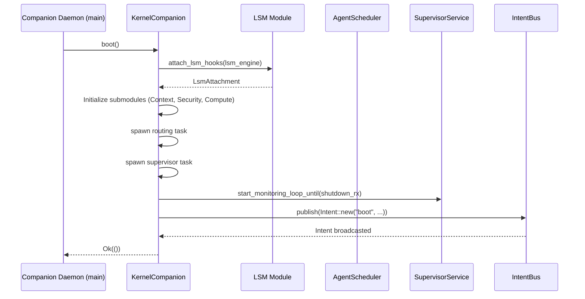
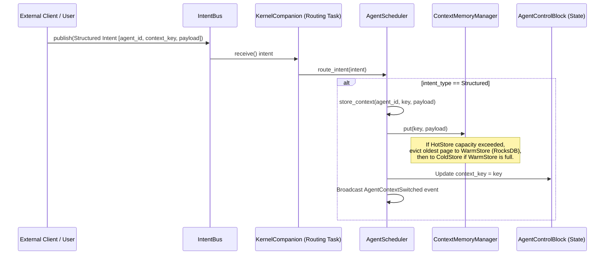
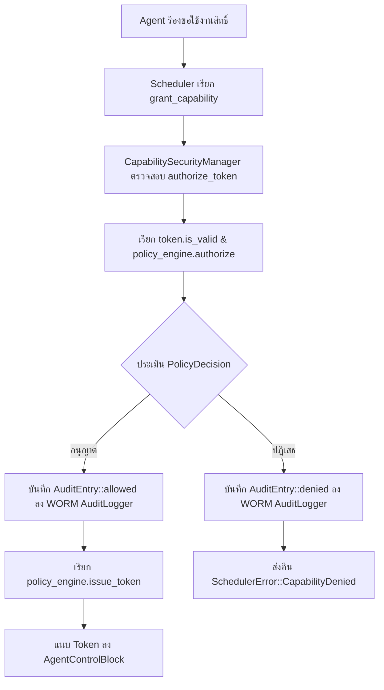

# สารระบบฟังก์ชัน ความสัมพันธ์ และข้อผิดพลาด (Functions, Relationships, and Errors)

เอกสารนี้รวบรวมรายละเอียดของฟังก์ชันทั้งหมดในระบบ ความสัมพันธ์ในการทำงานร่วมกัน (Data & Call Flow) และโครงสร้างการจัดการข้อผิดพลาด (Error Handling) ของโครงการ **AI-Native Kernel (Prototype Phase 1)** เพื่อให้เห็นภาพรวมเชิงสถาปัตยกรรมแบบบูรณาการ

---

## 1. สารระบบฟังก์ชันแยกตามโมดูล (Function Registry by Crate)

### 1.1 kernel-companion
โมดูลหลักที่เป็น Composition Root ทำหน้าที่เริ่มต้นระบบ เชื่อมต่อส่วนประกอบย่อย และควบคุม LSM/eBPF Hooks
*   **ไฟล์อ้างอิง:** [kernel-companion/src/lib.rs](file:///home/lokis/Documents/AI-Native-Kernel/crates/kernel-companion/src/lib.rs), [kernel-companion/src/lsm.rs](file:///home/lokis/Documents/AI-Native-Kernel/crates/kernel-companion/src/lsm.rs), [kernel-companion/src/ebpf/mod.rs](file:///home/lokis/Documents/AI-Native-Kernel/crates/kernel-companion/src/ebpf/mod.rs)

| โครงสร้าง/โมดูล | ฟังก์ชัน/เมธอด | คำอธิบาย |
| :--- | :--- | :--- |
| `KernelCompanion` | `new() -> Self` | สร้างอินสแตนซ์และจับคู่โมดูลย่อยทั้งหมด (Scheduler, Memory, Security, Intent Bus) |
| | `boot(&mut self) -> Result<()>` | โหลดและแนบ LSM hooks, สปอน Task สำหรับ Intent routing และ Supervisor, ส่งเหตุการณ์ Boot สำเร็จ |
| | `run(self) -> Result<()>` | รันระบบ เฝ้ารอสัญญาณ Ctrl+C และปิดการทำงานอย่างปลอดภัย |
| | `shutdown(&mut self)` | ส่งสัญญาณหยุดทำงานไปยัง Background Tasks ทั้งหมด และยกเลิกการแนบ LSM Hooks |
| | `classify_intent(&self, intent_type: &IntentType) -> &'static str` | จำแนกประเภท Intent เป็น Scheduler class: `interactive`, `batch`, `eco`, `realtime` |
| `LsmPolicyEngine` | `new() -> Self` | กำหนดค่าเริ่มต้นของระบบตัดสินใจ (Default: fail-closed / Deny) |
| | `decision_for_syscall(&self, syscall: &str) -> LsmDecision` | ตรวจสอบ syscall และตัดสินใจ (อนุญาตเฉพาะ `read`, `write`, `recvmsg`) |
| `LsmAttachment` | `new() -> Self` / `detach(&mut self)` | จำลองสถานะการแนบ/ถอด LSM Hook กับ Linux kernel |
| `SyscallTracer` | `new(policy) -> (Self, SyscallEventReceiver)` | สร้างตัวดักจับเหตุการณ์การเรียกใช้ syscall พร้อมสร้างช่องทางรับส่งข้อมูลขนาด 4096 entries |
| | `run(self, cancel) -> Result<(), TracerError>` | ลูปหลักของ eBPF Tracer (ใน Phase 1 จำลองด้วย software ring buffer) |
| | `process_syscall_event(&self, nr, pid, uid) -> SyscallEvent` | แปลงหมายเลข syscall เป็นชื่อ และส่งให้ `LsmPolicyEngine` ตัดสินใจนโยบายความปลอดภัย |

---

### 1.2 agent-scheduler
โมดูลสำหรับจัดการวงจรชีวิต คิวลำดับความสำคัญ และระบบ Self-healing ของ AI Agents
*   **ไฟล์อ้างอิง:** [agent-scheduler/src/scheduler.rs](file:///home/lokis/Documents/AI-Native-Kernel/crates/agent-scheduler/src/scheduler.rs), [agent-scheduler/src/supervisor.rs](file:///home/lokis/Documents/AI-Native-Kernel/crates/agent-scheduler/src/supervisor.rs)

| โครงสร้าง/โมดูล | ฟังก์ชัน/เมธอด | คำอธิบาย |
| :--- | :--- | :--- |
| `AgentScheduler` | `new(intent_bus, context_memory, capability_security) -> Self` | สร้างตัวจัดคิว Agent และผูก Supervisor service |
| | `allocate_agent_id(&self) -> u64` | สร้าง ID ใหม่ให้แก่ Agent แบบ Thread-safe (Auto-increment) |
| | `spawn_agent(&self, agent: AgentControlBlock) -> Result<u64>` | ลงทะเบียน Agent ใหม่เข้าสู่ระบบ เปลี่ยนสถานะเป็น `Running` และส่ง Event ออกทางช่อง Monitor |
| | `route_intent(&self, intent: Intent) -> Result<()>` | ดักฟังคำสั่งจาก Intent Bus: เช่น `spawn-agent` หรือ structured update เพื่อจัดเก็บ context |
| | `pause_agent(&self, id) -> Result<()>` / `resume_agent(&self, id) -> Result<()>` | สั่งพักหรือเปิดการทำงานใหม่ของ Agent และเปลี่ยนสถานะใน `AgentControlBlock` |
| | `terminate_agent(&self, id) -> Result<()>` / `fail_agent(&self, id) -> Result<()>` | ปิดการทำงาน (ลบออกจากระบบ) หรือตั้งสถานะ Agent ให้ล้มเหลว (Failed) |
| | `store_context(&self, id, key, value) -> Result<()>` | อัปเดตข้อมูลบริบทลง `ContextMemoryManager` และระบุ key ใน `AgentControlBlock` |
| | `grant_capability(&self, id, token) -> Result<()>` | ขอสิทธิ์การเข้าใช้งานจาก `CapabilitySecurityManager` และแนบ Token เข้ารายการของ Agent |
| `SupervisorService` | `new(agents, max_restarts, backoff_ms) -> Self` | กำหนดค่าขีดจำกัดการรีสตาร์ต และเวลา Exponential backoff |
| | `monitor_agent(&self, agent) -> bool` | เฝ้าระวัง Agent รายตัว (กู้ภัยหากเป็น `Failed` หรือล้างประวัติการตายหากกลับมา `Running`) |
| | `restart_agent(&self, id) -> bool` | ดำเนินการรีสตาร์ต Agent: ตั้งสถานะเป็น `Restarting` -> หน่วงเวลา -> เปลี่ยนเป็น `Running` |
| | `start_monitoring_loop_until(&self, shutdown_rx)` | ลูปตรวจตราสุขภาพของ Agent ทุก 100ms จนกว่าจะได้รับสัญญาณปิดระบบ |

---

### 1.3 intent-bus
ระบบส่งผ่านข่าวสารและเจตจำนง (Intents) ระหว่างโมดูลย่อยแบบกระจายสัญญาณ
*   **ไฟล์อ้างอิง:** [intent-bus/src/lib.rs](file:///home/lokis/Documents/AI-Native-Kernel/crates/intent-bus/src/lib.rs)

| โครงสร้าง/โมดูล | ฟังก์ชัน/เมธอด | คำอธิบาย |
| :--- | :--- | :--- |
| `Intent` | `new(id, type, payload, priority, source) -> Self` | สร้างข้อมูลเจตจำนงพร้อมเก็บเวลาระบบและตั้งค่า metadata เริ่มต้น |
| `IntentBus` | `new(capacity) -> Self` | เริ่มต้นระบบกระจายสัญญาณ (Broadcast) พร้อมระบบลงทะเบียนตัวกรอง (Filters) |
| | `subscribe(&self) -> IntentSubscriber` | สปอนช่องทางรับข่าวสารแยกให้แก่โมดูลย่อยที่สนใจ |
| | `publish(&self, intent: Intent) -> Result<()>` | ส่งผ่านและกระจายสัญญาณ Intent สู่ผู้รับทั้งหมดบนช่องสัญญาณ |
| | `add_filter(&self, filter)` / `remove_filter(&self, name)` | เพิ่มหรือถอดกฎการคัดกรอง Intent |
| | `passes_filters(&self, intent) -> bool` | ตรวจสอบว่า Intent นั้นผ่านเงื่อนไขของตัวกรองที่เปิดใช้งานทั้งหมดหรือไม่ |
| | `process_intents(&self, processor)` | รันลูปวนรับและกรอง Intent แล้วส่งต่อไปประมวลผลที่ตัวประมวลผลปลายทาง |

---

### 1.4 context-memory
ระบบจัดการหน่วยความจำบริบทแบบลำดับชั้น (Hot -> Warm -> Cold Storage) เพื่อสลับและลดการใช้งาน RAM
*   **ไฟล์อ้างอิง:** [context-memory/src/lib.rs](file:///home/lokis/Documents/AI-Native-Kernel/crates/context-memory/src/lib.rs)

| โครงสร้าง/โมดูล | ฟังก์ชัน/เมธอด | คำอธิบาย |
| :--- | :--- | :--- |
| `ContextMemoryManager` | `new() -> Self` / `with_capacity(hot, warm) -> Self` | สร้างผู้จัดการหน่วยความจำและกำหนดโควต้าเก็บข้อมูลในแต่ละชั้น |
| | `put(&self, key, value)` | บันทึกข้อมูลบริบทลงใน Hot Store (หากเต็มจะย้ายข้อมูลเก่าไป Warm/Cold ตามลำดับ) |
| | `get(&self, key) -> Result<Vec<u8>>` | ค้นหาข้อมูลบริบทตามลำดับความสำคัญของคลัง (Hot -> Warm -> Cold) |
| | `promote(&self, key) -> Result<()>` | ดึงข้อมูลจาก Warm/Cold tier กลับคืนขึ้นมาจัดเก็บในชั้น Hot Store (RAM) |
| | `demote(&self, key) -> Result<()>` | ย้ายข้อมูลจาก Hot Store ลงไปเก็บยังชั้น Warm Store ทันที |
| | `tier_of(&self, key) -> Option<&'static str>` | คืนค่าระบุว่าข้อมูลถูกบันทึกอยู่ที่คลังชั้นใดในปัจจุบัน (`hot`, `warm`, หรือ `cold`) |

---

### 1.5 compute-scheduler
ระบบประเมินประสิทธิภาพและจัดสรรทรัพยากรประมวลผล (CPU/GPU/NPU) ตามภาระงานและน้ำหนักที่ปรับตัวได้
*   **ไฟล์อ้างอิง:** [compute-scheduler/src/lib.rs](file:///home/lokis/Documents/AI-Native-Kernel/crates/compute-scheduler/src/lib.rs), [compute-scheduler/src/placement.rs](file:///home/lokis/Documents/AI-Native-Kernel/crates/compute-scheduler/src/placement.rs), [compute-scheduler/src/weights.rs](file:///home/lokis/Documents/AI-Native-Kernel/crates/compute-scheduler/src/weights.rs)

| โครงสร้าง/โมดูล | ฟังก์ชัน/เมธอด | คำอธิบาย |
| :--- | :--- | :--- |
| `ComputeScheduler` | `new() -> Self` / `with_weights(weights) -> Self` | สร้าง Scheduler จัดสรรเป้าหมายประมวลผล |
| | `score(&self, profile: ComputeProfile) -> f64` | คำนวณคะแนนต้นทุนประสิทธิภาพฮาร์ดแวร์ (คะแนนยิ่งต่ำยิ่งคุ้มค่า) |
| | `choose_best(&self, candidates) -> Result<ComputeTarget>` | เปรียบเทียบและเลือกอุปกรณ์ที่คุ้มค่าสูงสุด (CPU, GPU, NPU, Cloud) |
| | `update_weights(&self, sample: ComputeProfile)` | อัปเดตน้ำหนักความหน่วง/พลังงาน/ต้นทุนด้วยสูตร EWMA (alpha = 0.1) |
| `AdaptiveWeights` | `from_mode(mode: SchedulerMode) -> Self` | กำหนดน้ำหนักเริ่มต้นตามโหมดการทำงาน (`Battery`, `Throughput`, `Cost`) |
| `PlacementPolicy` | `new(scheduler) -> Self` | สร้างนโยบายจัดสรรทรัพยากรที่คำนึงถึงประเภทภาระงาน |
| | `allowed_targets(workload: WorkloadClass) -> Vec<ComputeTarget>` | ตรวจสอบ Allowlist ของอุปกรณ์ (เช่น LargeLlm ต้องรันบน Gpu/Cloud เท่านั้น) |
| | `place(&self, workload, profiles) -> Result<ComputeTarget>` | จัดวางและเลือกอุปกรณ์ที่ดีที่สุดสำหรับงาน โดยคำนวณจากข้อจำกัดและประสิทธิภาพจริง |

---

### 1.6 capability-security
ระบบจัดการความปลอดภัยระดับ Zero-Trust ออก/อนุมัติโทเค็นสิทธิ์ และบันทึกประวัติการเรียกใช้แบบ WORM
*   **ไฟล์อ้างอิง:** [capability-security/src/lib.rs](file:///home/lokis/Documents/AI-Native-Kernel/crates/capability-security/src/lib.rs), [capability-security/src/policy.rs](file:///home/lokis/Documents/AI-Native-Kernel/crates/capability-security/src/policy.rs), [capability-security/src/audit.rs](file:///home/lokis/Documents/AI-Native-Kernel/crates/capability-security/src/audit.rs)

| โครงสร้าง/โมดูล | ฟังก์ชัน/เมธอด | คำอธิบาย |
| :--- | :--- | :--- |
| `CapabilitySecurityManager` | `new() -> Self` / `new_with_log_path(path) -> Self` | สร้างผู้จัดการสิทธิ์ความปลอดภัย และเปิดใช้ระบบ Audit log |
| | `issue_token(&self, token: CapabilityToken) -> Result<()>` | ออกและลงทะเบียน Token สิทธิ์ตัวใหม่ พร้อมบันทึกประวัติลง WORM log |
| | `authorize_token(&self, token, capability) -> Result<bool>` | ตรวจสิทธิ์ของโทเค็นเทียบกับขีดความสามารถที่ร้องขอ และบันทึกผลตรวจสอบ |
| | `validate(&self, id, secret, scope, capability) -> Result<bool>` | ยืนยันสิทธิ์โดยเปรียบเทียบรหัสลับแบบคงเวลา (Constant-time comparison) ป้องกัน Timing attacks |
| | `decision_for(&self, id, secret, scope, capability) -> Result<PolicyDecision>` | คืนผลตัดสินใจระดับความปลอดภัย (Allow/Deny) ลงบันทึกประวัติตรวจสอบ |
| `PolicyEngine` | `new(default_decision) -> Self` | สร้าง Engine ประเมินกฎความปลอดภัย (สิทธิ์ดีฟอลต์ในระบบคือ "read", "execute") |
| | `decision(&self, token, scope, capability) -> PolicyDecision` | ตัดสินใจโดยเช็ค: (1) อายุของโทเค็น (2) มีสิทธิ์ร้องขอในโทเค็น (3) สิทธิ์อยู่ในระบบ Allowlist (4) ขอบเขตตรงกัน |
| `AuditLogger` | `new(log_path) -> Self` | เริ่มต้นระบบเขียนต่อท้ายเท่านั้น (WORM) เพื่อจัดเก็บข้อมูลประวัติอย่างมั่นคง |
| | `record(&self, entry: AuditEntry) -> Result<(), AuditError>` | เขียนบันทึกการตัดสินใจ (`issued`, `allowed`, `denied`) ลงระบบล็อกไฟล์แบบปลอดภัย |
| | `entries(&self) -> Vec<AuditEntry>` | ดึงประวัติความปลอดภัยทั้งหมดจากล็อกไฟล์ |

---

## 2. ความสัมพันธ์และการไหลของข้อมูล (Function Relationships & Data Flow)

### 2.1 สถาปัตยกรรมตอนเริ่มต้นระบบ (Boot Initialization Flow)
เมื่อระบบเรียกฟังก์ชัน `boot()` ของ `KernelCompanion` ขั้นตอนความสัมพันธ์ของแต่ละฟังก์ชันจะทำงานดังนี้:



---

### 2.2 วงจรการส่ง Intent และกระบวนการจัดตารางทำงาน (Intent Routing & Paging Context)
ขั้นตอนความสัมพันธ์ของฟังก์ชันในการส่งผ่านเจตจำนงแบบโครงสร้าง (Structured Intent) เพื่อลงทะเบียนข้อมูลของ Agent:



---

### 2.3 ระบบการตรวจสอบสิทธิ์ความปลอดภัยแบบ Zero-Trust (Security Decision Flow)
ขั้นตอนเมื่อ Agent ร้องขอการใช้งาน Capability:



---

### 2.4 ระบบเฝ้าระวังและฟื้นฟูสุขภาพตนเอง (Self-Healing Supervisor Flow)
ความสัมพันธ์ของฟังก์ชันในลูปดูแลระบบ เมื่อตรวจพบการทำงานที่ล้มเหลว:

```mermaid
loop ทุก ๆ 100ms
    SupervisorService->>SupervisorService: ดึง Snapshot รายการ Agent ทั้งหมด
    loop สำหรับแต่ละ Agent
        SupervisorService->>SupervisorService: เรียก monitor_agent(agent)
        alt agent.state == Failed และ restart_attempts < max_restarts
            SupervisorService->>SupervisorService: หน่วงเวลา Exponential Backoff
            SupervisorService->>SupervisorService: เรียก restart_agent(agent_id)
            note over SupervisorService: เปลี่ยนสถานะเป็น Restarting -> หน่วงเวลา 100ms -> เปลี่ยนเป็น Running
        else agent.state == Running
            SupervisorService->>SupervisorService: เรียก reset_restart_counter(agent_id)
        end
    end
end
```

---

## 3. สารระบบข้อผิดพลาดและการส่งต่อ (Error Registry & Mapping)

แต่ละโมดูลย่อยระบุ Domain Error เฉพาะของตนเอง เพื่อรักษาขอบเขตความล้มเหลว (Failure Domain Separation) ตารางต่อไปนี้อธิบายข้อผิดพลาดและฟังก์ชันที่เกี่ยวข้อง:

| ประเภทข้อผิดพลาด (Error Enum) | ข้อผิดพลาดจำเพาะ (Variant) | สาเหตุและเงื่อนไขที่เกิด | ฟังก์ชันที่ส่งคืน / ตรวจพบ |
| :--- | :--- | :--- | :--- |
| **LsmError** | `Denied` | Syscall ไม่อยู่ใน allowlist หรือถูกปฏิเสธ | `LsmPolicyEngine::decision_for_syscall` |
| | `AttachmentFailed` | ล้มเหลวในการผูก LSM hooks | `attach_lsm_hooks` |
| **TracerError** | `LoadFailed(String)` | eBPF program โหลดไม่ผ่าน | `SyscallTracer::run` |
| | `AttachFailed(String)` | แนบ eBPF กับ tracepoint ล้มเหลว | `SyscallTracer::run` |
| | `RingBufferError(String)` | อ่านข้อมูลจาก ring buffer ผิดพลาด | `SyscallTracer::run` |
| | `Cancelled` | Tracer ทำงานเสร็จแบบ Graceful shutdown | `SyscallTracer::run_simulation_loop` |
| **SchedulerError**| `AgentAlreadyExists` | สปอน Agent ซ้ำด้วย ID เดิม | `AgentScheduler::spawn_agent` |
| | `AgentNotFound` | ค้นหา Agent ที่ไม่มีอยู่จริงในระบบ | `pause_agent`, `resume_agent`, `terminate_agent`, `fail_agent`, `store_context`, `grant_capability` |
| | `AgentNotRunning` | สั่ง pause ในขณะที่ไม่ได้อยู่ในสถานะ Running | `AgentScheduler::pause_agent` |
| | `AgentNotPaused` | สั่ง resume ในขณะที่ไม่ได้อยู่ในสถานะ Paused | `AgentScheduler::resume_agent` |
| | `IntentDispatchFailed` | ส่ง Intent ลงบัสประมวลผลล้มเหลว | `AgentScheduler::submit_intent` |
| | `ContextUpdateFailed` | แยกแยะข้อมูล JSON/Metadata ล้มเหลว | `AgentScheduler::route_intent` |
| | `CapabilityDenied` | สิทธิ์ที่ร้องขอถูกปฏิเสธโดย Security Policy | `AgentScheduler::grant_capability` |
| | `CapabilitySecurityFailed` | เกิดข้อผิดพลาดของ Security Manager ภายใน | `AgentScheduler::grant_capability` |
| **IntentBusError**| `SendFailed` | ไม่มีผู้ติดตามหรือบัสส่งข้อมูลขัดข้อง | `IntentBus::publish` |
| **ContextError**  | `NotFound` | ค้นหาข้อมูลบริบทแล้วไม่พบใน Hot, Warm, Cold | `ContextMemoryManager::get`, `promote`, `demote` |
| **ComputeError**  | `NoTargetAvailable` | ไม่มีฮาร์ดแวร์ใดรองรับหรือผ่านนโยบายคัดเลือก | `ComputeScheduler::choose_best`, `PlacementPolicy::place` |
| **CapabilityError**| `TokenValidationFailed`| ล้มเหลวในการถอด/เทียบค่าพารามิเตอร์โทเค็น | `CapabilitySecurityManager::validate` |
| | `PolicyDecisionDenied` | นโยบายตรวจสอบและปฏิเสธคำร้องสิทธิ์ | `CapabilitySecurityManager::decision_for` |
| | `AuditWriteFailed` | ไม่สามารถบันทึกประวัติการใช้สิทธิ์แบบ WORM ลงไฟล์ได้ | `issue_token`, `authorize_token`, `validate`, `decision_for` (Fail-closed) |
| **AuditError**    | `Open` | เปิดล็อกไฟล์ `audit.log` ไม่สำเร็จ | `AuditLogger::record` |
| | `Serialize` | แปลงโครงสร้างเป็น JSON String ล้มเหลว | `AuditLogger::record` |
| | `Write` | เขียนเนื้อหาข้อความลงล็อกไฟล์ขัดข้อง | `AuditLogger::record` |

> [!IMPORTANT]
> **หลักการ Fail-Closed ในระบบความปลอดภัย:**
> ระบบ `CapabilitySecurityManager` ใช้หลักการ Fail-Closed อย่างเข้มงวด กล่าวคือ เมื่อการบันทึก Audit Log ผ่าน `AuditLogger` เกิดขัดข้อง (ไม่ว่าจะเกิดจาก Disk เต็ม หรือไฟล์สิทธิ์ถูกล็อก) ระบบจะส่งกลับข้อผิดพลาด `CapabilityError::AuditWriteFailed` ทันที และทำการปฏิเสธคำขอสิทธิ์ความปลอดภัยนั้นทันที เพื่อความมั่นคงสูงสุดของระบบปฏิบัติการ AI
