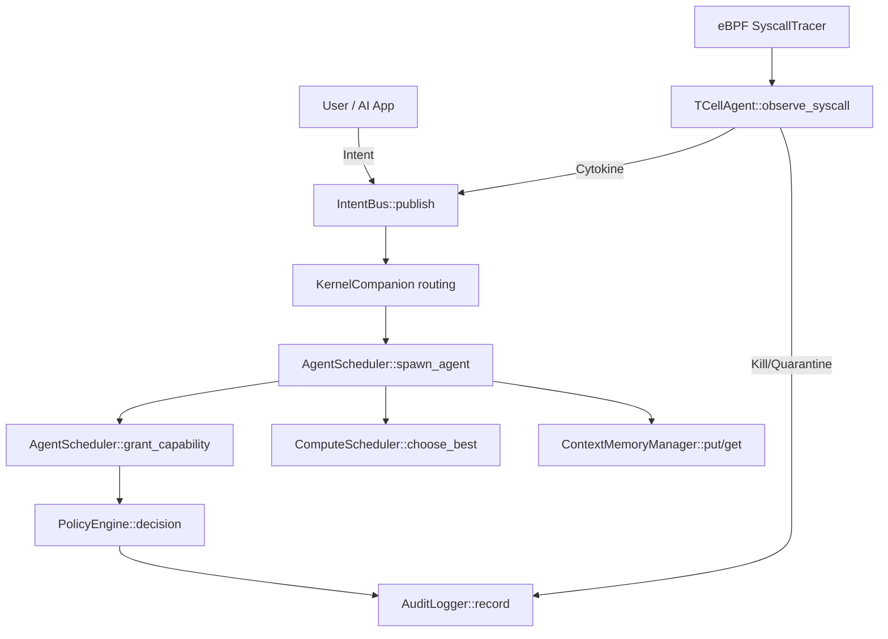

# 🗺️ Function Map — แผนที่ฟังก์ชันและความสัมพันธ์

Map of Content สำหรับฟังก์ชันหลักของระบบ แต่ละ note อธิบาย: หน้าที่, ผู้เรียก (callers), สิ่งที่เรียกต่อ (callees), errors และ performance — เปิด Graph View เพื่อดูความสัมพันธ์ทั้งระบบ

## เส้นทางหลักของข้อมูล (Primary Data Flow)

## ทะเบียนฟังก์ชันตามชั้นสถาปัตยกรรม

### Intent Layer
- [[intent-publish]] — `IntentBus::publish` / `subscribe` — broadcast intent เข้าระบบ

### Scheduling Layer
- [[spawn_agent]] — `AgentScheduler::spawn_agent` — สร้าง agent ใหม่ (P99 budget < 500µs, วัดจริง ~13µs)
- [[grant_capability]] — `AgentScheduler::grant_capability` — มอบ token ให้ agent พร้อม PAD salt
- [[choose_best]] — `ComputeScheduler::choose_best` — เลือกฮาร์ดแวร์จาก cost function

### Security Layer
- [[policy-decision]] — `PolicyEngine::decision` — จุดตัดสินใจ ALLOW/DENY (fail-closed)
- [[audit-record]] — `AuditLogger::record` — เขียน WORM log พร้อม hash chain
- [[validate_log]] — `AuditLogger::validate_log` — ตรวจความถูกต้องของ hash chain
- [[uds-authenticate]] — `UdsAuthenticator::authenticate` — zero-trust auth สำหรับ UDS commands

### Immune Layer
- [[observe_syscall]] — `TCellAgent::observe_syscall` — anomaly detection ต่อ syscall event (hot path, ~136ns)

### Memory Layer
- [[context-paging]] — `ContextMemoryManager` put/get/promote/demote — Hot/Warm/Cold/VRAM tiering

### Infrastructure
- [[build_http_client]] — helper สร้าง HTTP client สำหรับ inference engines

## เอกสารที่เกี่ยวข้อง
- [[functions-and-errors]] — ทะเบียนฟังก์ชันฉบับตารางรวม
- [[error-handling]] — โครงสร้าง error ทั้งระบบ
- [[implementation-status]] — สถานะปัจจุบันของแต่ละโมดูล
